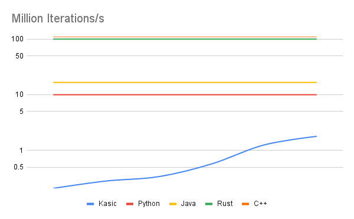

# Kasic
Kasic is an interpretuer that trys to replicate the usage of Unix commands but as a programming language.

### Command Line
```bash
% kasic
>>> print "Hello world"
Hello World
```

### Headless
```bash
% kasic hello_word.kasic
Hello World
```

## Examples
See the [examples](https://github.com/jackdelahunt/Kasic/tree/main/kasic/Examples) directories for more comprehansive examples.

### Type inference
```bash
num number 10
string *number | replace 1 2 | num number
print *number
```
```bash
20
```
### Loop iteration
```bash
num number 0
string prompt "The number is:"

> loop
print *prompt *number
add *number 0.01 | num number
goto loop
```
```bash
0.01
0.02
0.03
...
```
## Speed Comparision
See [here](https://github.com/jackdelahunt/Kasic/tree/main/kasic/Examples/Speed) for the code for each language.


### Kasic
|                | Speed(ms) |
| -------------- | --------- |
| 2021-07-24     | 4820      |
| 2021-07-25     | 3560      |
| 2021-07-26     | 2970      |
| 2021-07-27     | 1760      |
| 2021-07-28     | 800       |
| 2021-07-29     | 560       |


### In comparision
| Language | Speed(ms) |
| -------- | --------- |
| Python   | 100       |
| Java     | 6         |
| Rust     | 1         |
| C++      | <1        |

### Million iterations per second for each language compared 

